  

  
  &nbsp;
  
  &nbsp;
  

 

---

## 👨‍💻 About Me

Backend Software Engineer focused on building **modular, scalable, and maintainable systems**.
Currently a 4th-year Software Engineering student at **MSA University**, with a trajectory aimed at **fintech infrastructure** and **distributed systems**.

- 🏗️ Building systems with **Clean Architecture** and **DDD** at the core
- 🗄️ Strong focus on **database design**, **system design**, and building for scale

---

## 🛠️ Tech Stack

  

| Layer | Technologies |
|---|---|
| **Languages** | C#, Java |
| **Frameworks** | .NET, ASP.NET Core |
| **Databases** | PostgreSQL, Redis |
| **Messaging** | RabbitMQ |
| **DevOps** | Docker, Git |

---

## 📌 Featured Projects

### 🏦 [kyx](https://github.com/YOUR_GITHUB_USERNAME/kyx) — Modular Monolith
> A financial reserving system for football pitches built with **C# / .NET**.
> Engineered with a focus on domain isolation, leveraging **RabbitMQ** for async messaging, **Redis** for high-speed caching, and **PostgreSQL** for strict relational data management.

`C#` `.NET` `PostgreSQL` `Redis` `RabbitMQ` `Clean Architecture` `DDD`

---

### 🚦 [Traffic Radar Engine](https://github.com/YOUR_GITHUB_USERNAME/traffic-radar-engine) — Java System
> A Java-based rules engine implementing strict **interface contracts** and **data records** to isolate and evaluate complex traffic observation logic.

`Java` `OOP` `Interface Design` `Records`

---

## 💼 Experience & Assessments

| Organization | Role / Status |
|---|---|
| **Fawry** | Technical Evaluation — Java Traffic Radar Engine |
| **Thndr** | Fintech Backend Assessment Candidate |
| **I-Score** | Summer Internship Candidate |

---

## 📊 GitHub Analytics

  
  &nbsp;
  

  

---

  Built with precision · Engineered to scale

